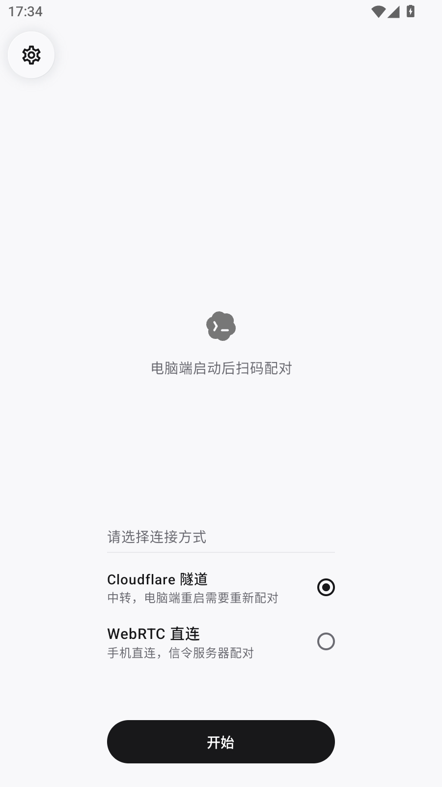
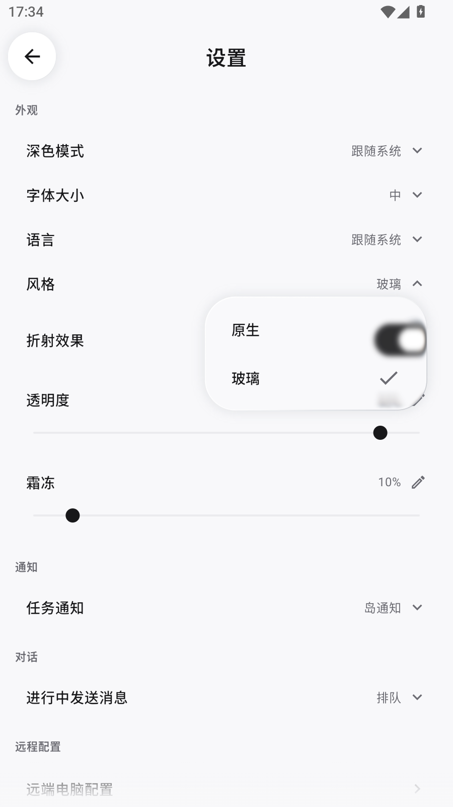
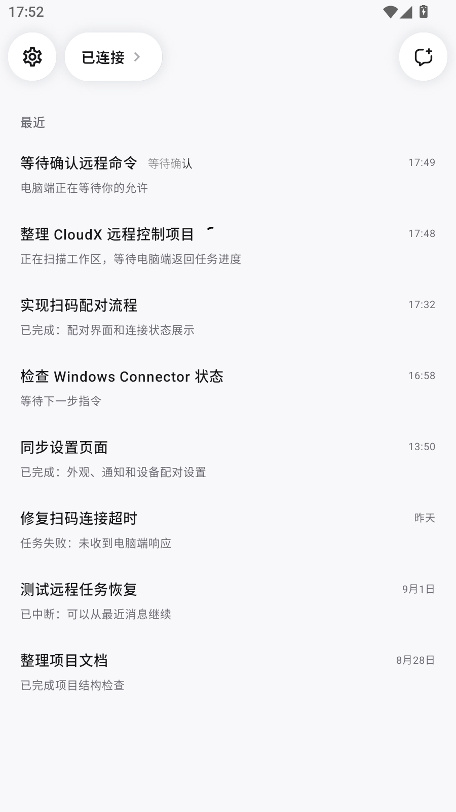
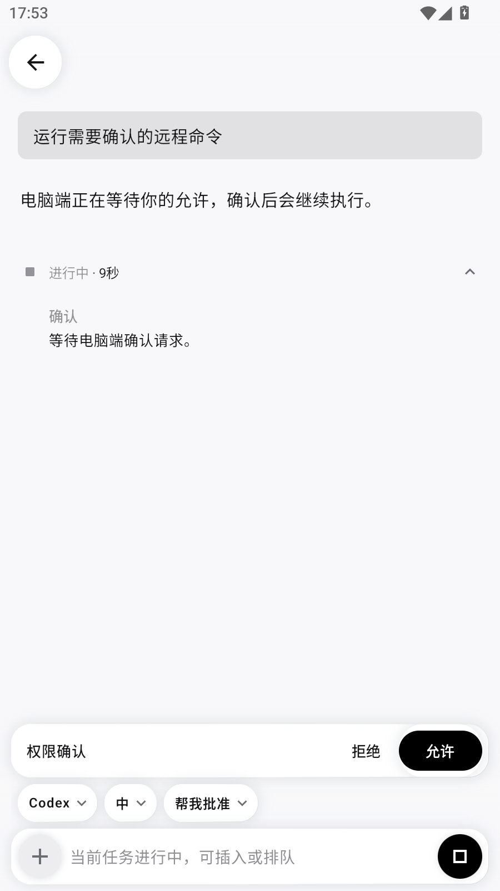
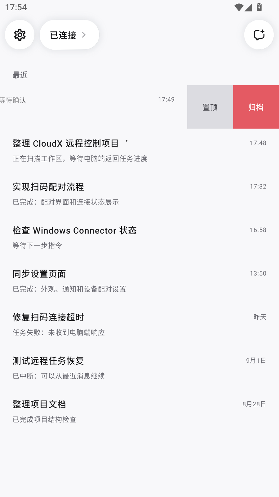

# CloudX

**中文** | [English](#english)

`CloudX` 是一个面向 Codex 的独立第三方 Android 远程控制客户端。它通过一次性
二维码与受支持的 Windows 桌面端配对，让你可以在 Android 设备上查看和操作
Codex 对话。CloudX 与 OpenAI 没有隶属、授权或背书关系。

## 下载

[**下载最新版 CloudX APK**](https://github.com/DENGGL2/CloudX/releases/download/v0.1.24/CloudX-0.1.24-arm64-v8a-debug.apk)

## 界面截图

| 1. 选择配对方式 | 2. 外观与语言设置 | 3. 已连接会话列表 | 4. 权限确认与运行状态 | 5. 会话置顶与归档 |
|:--:|:--:|:--:|:--:|:--:|
| [](docs/screenshots/01-pairing-methods.png) | [](docs/screenshots/02-appearance-settings.png) | [](docs/screenshots/03-connected-conversations.png) | [](docs/screenshots/04-approval-request.png) | [](docs/screenshots/05-conversation-actions.png) |

## 主要功能

- 在手机上查看会话列表、对话详情、执行过程和任务结果。
- 新建对话、发送消息，并处理电脑端发起的权限确认。
- 通过一次性二维码完成设备配对，支持 Cloudflare Tunnel 和 WebRTC Direct。
- 支持附件、图片预览与任务状态通知。
- 支持跟随系统、中文和 English 三种界面语言选项。
- 支持原生与玻璃界面风格，并可调整字体和玻璃效果。

## 对话功能

### 发起新对话

- 输入要交给 Codex 的任务描述。
- 选择电脑端提供的项目和模型。
- 按所选模型支持的范围选择推理层级。
- 选择请求批准、帮我批准或完全访问权限；不可用的权限不会开放选择。
- 项目、模型、推理层级和权限选项均由已配对的电脑动态提供，创建成功后会直接进入对话详情。

### 对话详情结构

- 用户消息、Codex 回复和执行过程按时间顺序呈现。
- 执行活动集中分组，支持思考、命令、网页搜索、工具调用、文件修改、计划和图片等类型。
- 显示进行中、已完成、已停止和失败状态，并在可用时显示执行耗时。
- 运行中的执行详情自动展开，任务结束后默认收起；可随时点击查看每一步。
- 命令活动可打开命令详情，分别查看和复制命令及输出。
- 回复内容支持标题、列表、任务项、引用、代码块、表格和差异内容等 Markdown 展示。
- 图片附件支持缩略图和大图预览；文件附件支持内容预览和下载。

### 对话详情操作

- 在发送前切换模型、推理层级和访问权限。
- 添加图片、添加文件，或从电脑端可用列表中选择 Skill。
- 任务运行中可以发送新指令并按设置插队或排队，也可以停止当前任务。
- 收到权限请求时可直接允许或拒绝；离开最新位置后可一键回到最新消息。

无论选择哪种网络传输方式，移动端都使用相同的配对、设备身份、权限、会话、
对话、确认和附件协议。

## 使用流程

1. 在 Android 手机上安装 CloudX APK。
2. 在需要配对的 Windows 电脑上克隆本仓库并准备运行环境。
3. 启动 `desktop-connector\pair.bat`。默认使用 Cloudflare Tunnel；传入 `2`
   使用 WebRTC Direct。
4. 手机端选择相同的连接方式并点击“开始”。
5. 扫描桌面端显示的二维码，核对设备信息后确认配对。

```powershell
.\desktop-connector\pair.bat
```

## 连接方式

### Cloudflare Tunnel

Cloudflare 模式使用 Quick Tunnel，不需要账号、域名或令牌。Quick Tunnel 地址会
在桌面端重启后变化，因此每次重新启动后都需要扫描新二维码。

`cloudflared.exe` 必须位于 `PATH` 中，也可以通过
`CLOUDX_CLOUDFLARED_PATH` 指定完整路径。Cloudflare 承载远程 HTTPS 请求；
本地 Connector 服务仍只监听 `127.0.0.1`，应用层挑战-响应认证仍然启用。

### WebRTC Direct

WebRTC 模式会启动仓库内的信令服务，并通过公开的 HTTPS Quick Tunnel 暴露信令
入口。正常对话和文件数据通过加密 DataChannel 或 TURN 中继传输，Cloudflare
不承载这些数据。

STUN 本身不能跨网络中继数据。如需提高受限网络下的连接成功率，请配置短时
有效的 TURN 凭据，并在手机网络阻止 UDP 时提供 TCP/443 地址：

```powershell
$env:CLOUDX_WEBRTC_TURN_SERVERS = "turns:turn.example.com:443|username|credential"
.\desktop-connector\pair.bat 2
```

使用 Cloudflare Realtime TURN 时，请将长期密钥和 API Token 保留在 Windows
电脑上，由 `pair.bat` 为每次配对生成短时凭据：

```powershell
$env:CLOUDX_CLOUDFLARE_TURN_KEY_ID = "your-turn-key-id"
$env:CLOUDX_CLOUDFLARE_TURN_API_TOKEN = "your-turn-api-token"
.\desktop-connector\pair.bat 2
```

如果未配置 TURN，WebRTC 仍会尝试直连，但在 NAT 或防火墙限制下可能失败。
Cloudflare Quick Tunnel 也不能保证在所有网络环境下都无需 VPN。

## 配对与安全

二维码只包含短时有效的签名引导数据。手机完成配对后只保存设备身份和授权
路由，不保存一次性二维码令牌或 nonce。过期或重复使用的配对邀请会被拒绝，
桌面 Connector 也可以从状态存储中撤销已授权的手机。

TURN 长期密钥和 API Token 不会写入二维码或打包进 APK。提交日志或截图前，
请移除二维码、配对令牌、TURN 凭据、访问令牌及其他敏感信息。

## 从源码构建

需要 JDK 17、Node.js、Android SDK、Gradle 构建环境、Codex CLI 和
`cloudflared.exe`。使用以下命令构建手机 ARM64 Debug APK：

```powershell
.\gradlew.bat :app:assembleDebug -Parm64Only=true
```

APK 输出到 `app/build/outputs/apk/debug/`。

### 版本规则

- `versionName` 遵循 `主版本.次版本.修订号`：不兼容变更递增主版本，兼容的新功能递增次版本，兼容的修复、视觉调整和文档更新递增修订号。
- `versionCode` 是 Android 使用的单调递增整数；每次发布可分发 APK 都递增 1，不回退、不复用。
- 每次发布同步更新 `versionName`、`versionCode`、`v<versionName>` Git 标签和 GitHub Release；README 的下载链接始终指向最新 Release。

## 自动构建

[GitHub Actions](https://github.com/DENGGL2/CloudX/actions) 会构建并上传 ARM64
Debug APK。发布正式版本前，请配置 Android SDK 和正式发布签名密钥。

## 支持与联系方式

Bug、功能建议和项目问题请提交到
[GitHub Issues](https://github.com/DENGGL2/CloudX/issues)。

## 许可证

CloudX 使用 [MIT 许可证](LICENSE)。第三方依赖和随项目发布的资源可能受其
各自许可证约束。

---

<a id="english"></a>

## English

`CloudX` is an independent, third-party Android remote-control client for
Codex. It pairs with a supported Windows desktop agent through a one-time QR
code, allowing you to view and operate Codex conversations from an Android
device. CloudX is not affiliated with or endorsed by OpenAI.

### Download

[**Download the latest CloudX APK**](https://github.com/DENGGL2/CloudX/releases/download/v0.1.24/CloudX-0.1.24-arm64-v8a-debug.apk)

### Highlights

- View conversations, execution progress, and task results from your phone.
- Start conversations, send messages, and handle approval requests remotely.
- Pair through a signed, short-lived QR code.
- Choose Cloudflare Tunnel or WebRTC Direct as the transport.
- Use attachments, image previews, and task status notifications.
- Select Follow system, Chinese, or English for the interface language.

### Conversation workflow

When starting a conversation, enter the task and choose a project, model,
supported reasoning level, and access profile supplied by the paired computer.

The detail screen keeps user messages, Codex replies, and execution activity in
chronological order. Grouped activity covers reasoning, commands, web searches,
tools, file changes, plans, and images, with status and duration where available.
Command details expose copyable commands and output, while Markdown, image
previews, file previews, and downloads keep results readable on the phone.

Before sending, you can change the model, reasoning level, and access profile;
attach images or files; or select an available Skill. While a task is running,
new instructions can steer the active task or wait in the queue. You can also
stop the task, allow or decline approval requests, and jump to the latest
message.

### Quick start

1. Install the CloudX APK on Android.
2. Run the Windows Agent from this repository:

```powershell
.\desktop-connector\pair.bat
```

3. Select the same transport on the phone and scan the new QR code. Pass `2`
   to `pair.bat` to use WebRTC Direct.

Cloudflare mode uses a free Quick Tunnel and requires a new QR code after the
Agent restarts. WebRTC conversation and file data travel over an encrypted
DataChannel or TURN relay; Cloudflare is used only as the HTTPS signaling
entry point in this mode. Configure short-lived TURN credentials when direct
connectivity is unreliable.

### Build

Build the ARM64 Debug APK with JDK 17 and the Android SDK:

```powershell
.\gradlew.bat :app:assembleDebug -Parm64Only=true
```

The APK is written to `app/build/outputs/apk/debug/`.

### Versioning

- `versionName` follows `MAJOR.MINOR.PATCH`: use `PATCH` for compatible fixes, visual adjustments, and documentation updates; `MINOR` for compatible user-facing features; and `MAJOR` for incompatible protocol, storage, or workflow changes.
- `versionCode` is a monotonically increasing Android integer. Increase it by 1 for every distributable APK; never reuse or decrease a value.
- Every release updates both values, creates the matching `v<versionName>` Git tag and GitHub Release, and refreshes the README download links.

Please remove QR codes, pairing tokens, TURN credentials, access tokens, and
other secrets before attaching logs or screenshots to
[GitHub Issues](https://github.com/DENGGL2/CloudX/issues).

CloudX is licensed under the [MIT License](LICENSE).
